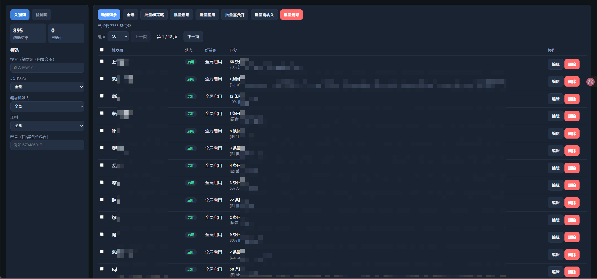

# 关键词回复 · maibot_plugin_keywords_reply

> MaiBot 关键词 / 检测词自动回复插件。由 [AstrBot 同名插件](https://github.com/Foolllll-J/astrbot_plugin_keywords_reply) 迁移至 MaiBot SDK 2.x。

[](LICENSE)
[](https://github.com/MaiM-with-u/MaiBot)
[](CHANGELOG.md)

---


## 目录

- [特性](#特性)
- [快速开始](#快速开始)
- [外部编辑器](#外部编辑器)
- [管理命令](#管理命令)
- [回复机制](#回复机制)
- [配置说明](#配置说明)
- [数据目录](#数据目录)
- [与 AstrBot 版差异](#与-astrbot-版差异)
- [许可证](#许可证)

---

## 特性

| 能力 | 说明 |
|------|------|
| 双模式触发 | **关键词**：整条消息首词精确匹配；**检测词**：消息包含即触发 |
| 富媒体回复 | 文本、图片、**本地视频**、语音、表情、音乐卡片、At；图片/语音/表情支持引用导入 |
| 有序多段回复 | 单条 entry 内按 `parts` 顺序分多条消息发送 |
| 多回复抽取 | 先按 `weight` 加权随机，再按 `probability` 判定是否回复 |
| 正则匹配 | 关键词 / 检测词均支持正则，内置 ReDoS 安全检查 |
| 群聊策略 | 每词条独立白名单 / 黑名单，或全局启用 / 禁用 |
| 变量模板 | `{user_id}` `{user_name}` `{group_id}` `{message}` `{date}` `{time}` 等 |
| 外部编辑 | 本地 Web 编辑器 + `keywords.json`，支持 7k+ 词条分页管理 |

> **权限**：仅 `permission.whitelist` 或 MaiBot 全局管理员可执行管理命令。白名单支持 `user_id` 或 `platform:user_id`。

---

## 快速开始

### 安装

将本仓库放入 MaiBot 插件目录，确保 `_manifest.json` 中 `id` 为 `maibot_plugin.keywords_reply`，重启 MaiBot 或在插件管理中启用。

### 数据路径

```
data/plugins/maibot_plugin.keywords_reply/
├── keywords.json      # 词条数据
├── config.toml        # 插件配置
├── images/            # 词库永久图片（不自动清理）
├── records/           # 词库永久语音（不自动清理）
├── emojis/            # 词库永久表情（不自动清理）
├── videos/            # 词库永久视频（仅本地放置，不自动清理）
└── media_cache/       # 入站临时缓存（图片/语音/表情；不含视频）
    ├── images/
    ├── records/
    └── emojis/
```

### 基本用法

1. 在群内发送管理命令（需管理员权限），例如：
   ```
   /添加关键词 早上好 早呀！
   ```
2. 或使用 [外部编辑器](#外部编辑器) 批量维护词库。
3. 外部保存后执行 `/重载词库` 使插件读取最新数据。

---

## 外部编辑器

目录 [`editor/`](editor/) 提供本地 Web 界面：总览、筛选、搜索、分页、批量增删改、结构化 entry 编辑。

**Windows**

```bat
editor\editor.bat
```

局域网其它设备访问（工作机起服务，另一台设备打开浏览器）：

```bat
editor\editor-lan.bat
```

启动后终端会打印 `http://192.168.x.x:8765`，在同一局域网设备上打开即可（无鉴权，仅可信局域网；必要时放行防火墙 8765）。

**命令行**

```bash
python editor/server.py --data-dir "你的MaiBot/data/plugins/maibot_plugin.keywords_reply"
# 局域网：
python editor/server.py --data-dir "..." --host 0.0.0.0 --port 8765
```

浏览器访问 `http://127.0.0.1:8765`（或局域网 IP）。保存后执行 `/重载词库` 或重启 MaiBot。

图片 / 语音 / 表情段只需填写文件名（如 `a.jpg`）；目录前缀由类型自动固定为 `images/`、`records/`、`emojis/`。

### 视频（仅本地加载）

**不支持**从 QQ 消息、引用消息或 `media_cache` 自动导入视频（避免无效下载与性能浪费）。

用法：

1. 把 `.mp4` 等文件放到 `data/plugins/maibot_plugin.keywords_reply/videos/`
2. 在编辑器中添加「视频」段，只填文件名（如 `demo.mp4`），或在 `keywords.json` 里写：
   ```json
   { "type": "video", "file": "demo.mp4" }
   ```
3. 保存后 `/重载词库`，触发关键词即可发出该本地视频



详见 [editor/README.md](editor/README.md)。OhData 迁移工具见 [tools/README.md](tools/README.md)。

---

## 管理命令

命令以 `/` 开头，需管理权限。将下表「关键词」替换为「检测词」即为检测词对应命令。

### 词条管理

| 命令 | 格式 |
|------|------|
| 添加 | `/添加关键词 [-r] <关键词> <回复内容>` |
| 添加音乐 | `/添加音乐 <关键词> <歌曲ID> [平台]` |
| 编辑 | `/编辑关键词 [-r] <序号/内容> <新关键词>` |
| 删除 | `/删除关键词 <序号/内容>` |
| 启用 | `/启用关键词 <序号/内容> [群号/全局]` |
| 禁用 | `/禁用关键词 <序号/内容> [群号/全局]` |
| 列表 | `/查看关键词列表`（别名 `/查看所有关键词`）`[页码]` |
| 帮助 | `/replyhelp` |
| 详情 | `/查看关键词 <序号/内容>` |
| 重载 | `/重载词库` |

### 回复管理

| 命令 | 格式 |
|------|------|
| 添加回复 | `/添加关键词回复 <序号/内容> [回复内容]` |
| 查看回复 | `/查看关键词回复 <序号/内容> [回复序号]` |
| 编辑回复 | `/编辑关键词回复 <序号/内容> [回复序号] <新内容>` |
| 删除回复 | `/删除关键词回复 <序号/内容> [回复序号]` |

### 高级设置

| 命令 | 格式 |
|------|------|
| 需@ | `/设置关键词需@ <序号/内容> on\|off` |
| 权重 | `/设置关键词权重 <序号/内容> <回复序号> <权重>` |

**说明**

- `-r` 表示正则触发词。
- 回复正文可省略，直接**引用一条消息**作为内容。
- 文本中可用 `[@12345]` 转义保存 At。
- 音乐平台默认 `163`（网易云），可选 `qq` / `migu` / `kugou` / `kuwo`。
- 图片 / 语音 / 音乐卡片：在同条消息附带，或引用对应消息后发命令；语音需在 `media_cache.group_whitelist` 群内提前缓存。
- **视频**：仅本地加载，见上文「视频（仅本地加载）」；不可引用 QQ 视频消息导入。

---

## 回复机制

### 多回复抽取

同一触发词下有多条 entry 时：

1. 按各条 **`weight`（权重）** 加权随机抽取一条；
2. 再按该条 **`probability`（概率 0–100%）** 判定是否实际发送。

`qq_forward_all_replies = true` 时，多条回复以合并转发形式全部发送（跳过上述随机逻辑）。

### 单条 entry 多段发送

entry 使用有序 `parts[]` 时，每一段单独发送一条消息，顺序与编辑器中一致。

### 需@机器人

`require_at_bot = true` 时，消息须包含对机器人的 `@`（`is_at`）或平台提及（`is_mentioned`）才会触发。

---

## 配置说明

配置文件：`config.toml`

| 分组 | 主要项 | 说明 |
|------|--------|------|
| `[plugin]` | `enabled` | 插件总开关 |
| `[permission]` | `whitelist` | 管理白名单 |
| | `notify_permission_denied` | 无权限时是否提示 |
| | `allow_group_member_list_*` | 是否允许群成员查看列表 |
| `[reply]` | `quote_reply` | 回复时引用触发消息 |
| | `qq_forward_all_replies` | 多回复合并转发 |
| | `case_sensitive` | 非正则是否区分大小写 |
| | `list_page_size` | 列表命令每页词条数（默认 40） |
| `[detect]` | `cooldown` | 检测词冷却（秒） |
| | `ignore_cooldown_on_exact_match` | 完全匹配时无视冷却 |
| `[template]` | `enable_text_template` | 启用变量模板 |
| `[media_cache]` | `group_whitelist` | 允许缓存入站富媒体的群号；**默认为空** |

```toml
[media_cache]
group_whitelist = ["673486917"]  # 填入需要引用导入媒体的测试群
```

---

## 数据目录

| 路径 | 内容 |
|------|------|
| `keywords.json` | 全部词条 |
| `images/` | 词库永久图片（不自动清理） |
| `records/` | 词库永久语音（不自动清理） |
| `emojis/` | 词库永久表情（不自动清理） |
| `videos/` | 词库永久视频（**仅本地放置**；不从入站消息/引用导入） |
| `media_cache/` | 入站临时缓存（图片/语音/表情）；总数超过 100 时滚动删最旧；写入词库时提升到永久目录 |

entry 结构示例：

```json
{
  "weight": 100,
  "probability": 80,
  "parts": [
    { "type": "text", "text": "早呀！" },
    { "type": "text", "text": "今天天气很好！" },
    { "type": "image", "file": "abc.jpg" }
  ]
}
```

---

## 与 AstrBot 版差异

<details>
<summary>点击展开迁移说明</summary>

### 已移除

- 自动撤回（`recall_delay`）—— MaiBot 无撤回接口
- 合并转发聊天记录导入（`forwards`）—— 无对应 API
- 内置 WebUI —— 改为 `editor/` 外部编辑器

### 实现变化

- 富媒体通过入站二进制落盘，发送时用 `send.hybrid` / `send.forward`
- 引用回复、At 使用 MaiBot 消息段（`reply` / `at`）
- QQ 原生表情（face）尽力支持；视频仅支持本地 ``videos/`` 文件发送，不从消息/引用拉取

### 触发挂载点

自动回复挂在 `chat.receive.after_process` Hook；`ON_MESSAGE` 事件处理器仅作未来兼容备用。

</details>

---

## 许可证

基于 [astrbot_plugin_keywords_reply](https://github.com/Foolllll-J/astrbot_plugin_keywords_reply) 迁移，遵循相同开源协议。

---

<p align="center">
  <sub>迁移自 AstrBot · 运行于 <a href="https://github.com/MaiM-with-u/MaiBot">MaiBot</a></sub>
</p>
